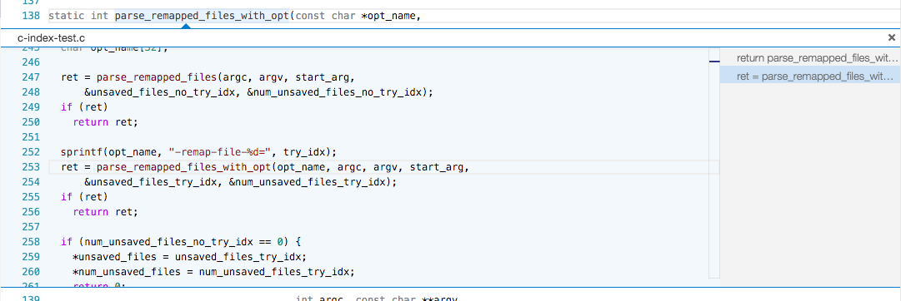

# README

C++ Intellisense 

Please go to [https://github.com/austin-----/code-gnu-global](https://github.com/austin-----/code-gnu-global) for source code, bug tracking, and feature request

## Functionality
Provide Intellisense for C/C++ with the help of the GNU Global tool in Visual Studio Code.

## Usage
1. Make sure you have GNU Global tool installed and added to PATH. 

2. In the workspace folder of your C/C++ project, run 'gtags'. This will generate the GTAGS, GRTAGS, and GPATH files. If you made changes to your code, run 'gtags' again to renew the tag files.

3. Install 'C++ Intellisense' in VS Code and then you can enjoy Intellisense for this project in VS Code.

4. If you are using Windows with a non-CP437 code page, or Linux/OSX with non-UTF8 encoding, please add 'codegnuglobal.encoding' to your settings.js (Preference - User Settings) and set its value to the custom encoding you are using (Please look at [https://github.com/ashtuchkin/iconv-lite/wiki/Supported-Encodings](https://github.com/ashtuchkin/iconv-lite/wiki/Supported-Encodings) for supported encodings).
   
   E.g.: (CP936 for Simplified Chinese on Windows)
   ```
   {
       'codegnuglobal.encoding': 'cp936'
   }
   ```

## Demo
* Go to definition


* Auto completion


* Find references



* List symbols


## Limitations
Since GNU Global is a tagging system, it does not do any AST parsing to understand class members and etc. 

### For more information
* [GNU Global](https://www.gnu.org/software/global/)
* [Repo](https://github.com/austin-----/code-gnu-global)
* [VS Code Marketplace](https://marketplace.visualstudio.com/items/austin.code-gnu-global)

**Enjoy!**
